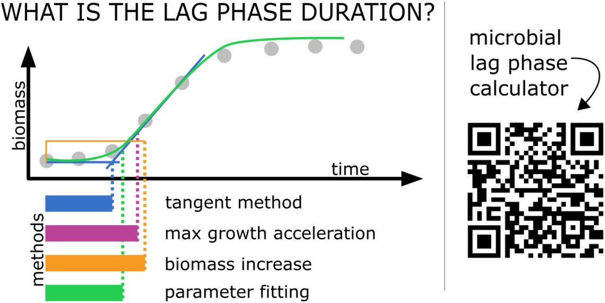

# miLAG: microbial lag phase duration analysis

[](https://www.repostatus.org/)
[](https://app.codecov.io/gh/jungwirt/microbial_lag_calculator)


Authors: Bogna J. Smug [][2],
Monika Opalek [][1], 
Maks Nęcki,
Dominika Wloch-Salamon [][3]

[1]: https://orcid.org/0000-0003-1414-901X
[2]: https://orcid.org/0000-0001-9364-163X
[3]: https://orcid.org/0000-0002-0040-1838



## Shiny app: Microbial lag calculator
[Shiny](https://dx.doi.org/10.18637/jss.v059.i10) applications are particularly 
convenient for use in a variety of R microbiological data calculation and 
visualization packages. This is because they are interactive stand-alone tools which do not require any additional software.
We invite to use our shiny web server: 

https://microbialgrowth.shinyapps.io/lag_calulator/ </br>

which allows to calculate microbial lag phase duration using popular methods and various data pre-processing techniques.
The manual can be found [here](https://github.com/bognabognabogna/microbial_lag_calculator/tree/main/shiny_app/lag_calulator)


## R package: miLAG

For the developper's use we invite to use either the local version of the shiny app 
or the [miLAG](https://github.com/bognabognabogna/microbial_lag_calculator) package which provides a variety of functions that enable lag calculations, and in particular the function: `calc_lag`. 


## Supported methods and models

`miLAG` aims to support a variety of of mathematical methods calculating microbial lag duration.
Currently supported methods include:
- tangent method,
- max grow acceleration method,
- biomass increase method,
- parameter fitting method,
</br>


## Installation

You can install the latest development version of `miLag` package from
GitHub with these R commands:

``` r
if (!require("remotes"))
  install.packages("remotes")

remotes::install_github("https://github.com/bognabognabogna/microbial_lag_calulator", dependencies = TRUE, force = TRUE)
```

and the local vesrion of the shiny application by further running:

``` r
#install.packages("shiny")
#library(shiny)
#runApp('~/shiny_app/lag_calulator/app.R')
```
## Input data

The accepted file formats for input data are csv and txt. The input to the application should be in a file format with two columns: The first should describe the time (preferably in hours). The second column should describe the population size (preferably in CFU/ml). Be sure to select the decimal separator appropriately - this can be modified in one of the windows in the application. An example input dataset should look like the following:

```
time;biomass
1;4396571,976
1,5;3807332,496
2;4165206,611
2,5;5690282,713
3;7727252,94
3,5;19381419,82
4;13744788,86
4,5;18066675,15
5;23651017,71
5,5;29465323,75
6;28528881,12
6,5;29448677,51
7;29144257,31
7,5;32086465,47
8;29732262,17
8,5;29888494,33
9;30720558,23
9,5;31220300
10;32074919,83
```


## Examples

This example shows the use of miLAG with the example dataset;

``` r
library(miLAG)
available.methods = list("max growth acceleration",
                         "tangent",
                         "biomass increase",
                         "parameter fitting to a model")
parameters.default = get_def_pars()
```

Imagine this dataset:

``` r
time = seq(1,24,0.1)
biomass = if_else(time < 5, 10^5, if_else(time < 10, 10^5*(exp(0.05*(time - 5))), 10^5*(exp(0.05*(5)))))
example =
  tibble(
    time = time,
    biomass = biomass
  )
```

Which can be visualised as a growth curve:
``` r
library(ggplot2)
ggplot(example) + geom_line(aes(x=time, y = biomass)) +
xlab("Time") +
ylab("CFU")
```

And the lag can be calculated 
``` r
get_lag(example, method = "max growth acceleration", pars = parameters.default)
```

Additionally, the input growth curve can be visualised together with the lag duration calculation rationale: 
``` r
lag.output = calc_lag(example, method = "max growth acceleration", pars = parameters.default)
plot_lag_fit(lag.output)
```


See `vignette("miLAG")` for a variety of additional examples and
more explanation of how it works.

## Additional functions that modify data

- `cut_data` 

This function causes the last biomass values to be cut off, depending on the selected number of points we want to discard. A two-column dataframe with "time" and "biomass" columns is used as the input dataset to this function. The function returns a dataframe with two columns: time and biomass. Example usage of the `cut_data` function:

```
 data = cut_data(example, cut_max_time)
```
<br/>

- `smooth_data` 

This function smooths the growth curve data. It uses the 3SRS method as the default argument of smooth_data. A two-column dataframe with "time" and "biomass" columns is used as the input dataset to this function. The function returns a dataframe with three columns: time, smoothed biomass and curve id. Example usage of the `smooth_data`  function:

``` 
 data = smooth_data(example, '3RS3R')
```

## Feedback, issues, and contributions

We welcome feedback, suggestions, issues, and contributions! Contact us
at <bogna.smug@uj.edu.pl>. If you have found a bug, please file it
[here](https://github.com/bognabognabogna/microbial_lag_calculator/issues/new) with minimal code
to reproduce the issue. Pull requests should be filed against the
[`dev`](https://github.com/bognabognabogna/microbial_lag_calculator/tree/dev) branch.

`miLAG` grew out of helper functions we wrote to make our own lag phase calculation
pipelines tidier. Over time it has expanded to cover more use cases we
have encountered, but we would love to make it cover more!
We also invite the scientific community to contribute to further improvements.

## Acknowledgements

We would like to thank Wolfram Moebius, Ryszard Korona, Joanna Rutkowska, Aleksandra Walczak, Hanna Tutaj and Adrian Piróg 
for the discussion and their valuable comments. The research was funded by the Priority Research Area BioS under the program 
Excellence Initiative – Research University at Jagiellonian University in Krakow to BJS; by the Polish National Agency of Academic Exchange, 
grant number PPN/PPO/2018/00021/U/00001 to BJS, the programme “Excellence Initiative–Research University” at the 
Jagiellonian University in Kraków, Poland (grant number U1U/W18/NO/28.07) to MO; the National Science Centre, 
Poland, the OPUS grant to D.W.-S. (grant number 2017/25/B/NZ8/01035); the Biology Department research subsidies (grant number N18/DBS/000019 to MO and DWS).

## Citing `miLAG`
Smug, B. J., Opalek, M., Necki, M., & Wloch-Salamon, D. (2024). Microbial lag calculator: A shiny-based application and an R package for calculating the duration of microbial lag phase. Methods in Ecology and Evolution, 15, 301–307. 
DOI: [10.1111/2041-210X.14269](https://doi.org/10.1111/2041-210X.14269).

## Disclaimer
**miLAG has been developed using the *Dplyr* package in R (R Core Team 2021). Please note the authors take no responsibility for the results. Calculating lags is tricky and the result may not always have a strict biological interpretation.**
